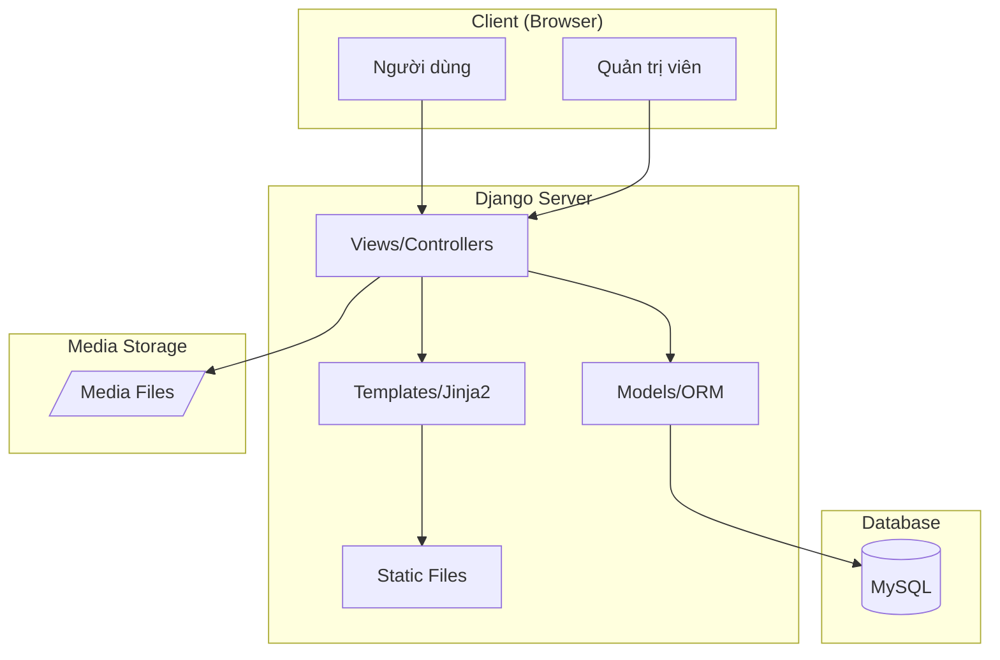
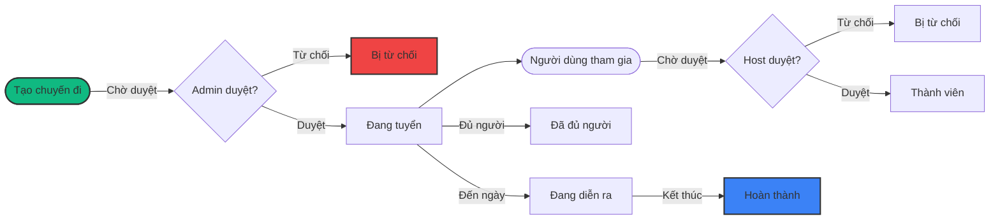
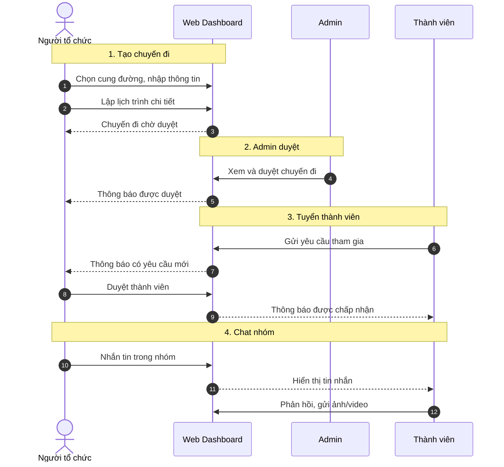

# TrekViet - Nền tảng Cộng đồng Trekking Việt Nam

> Hệ thống web toàn diện kết nối cộng đồng leo núi và trekking tại Việt Nam, hỗ trợ quản lý cung đường, tổ chức chuyến đi nhóm và chia sẻ trải nghiệm.

<p align="center">
  
  
</p>

## Mục lục

1. [Giới thiệu](#giới-thiệu)
2. [Tính năng chính](#tính-năng-chính)
3. [Kiến trúc hệ thống](#kiến-trúc-hệ-thống)
4. [Công nghệ sử dụng](#công-nghệ-sử-dụng)
5. [Cài đặt và Triển khai](#cài-đặt-và-triển-khai)
6. [Hướng dẫn sử dụng](#hướng-dẫn-sử-dụng)
7. [Ảnh chụp màn hình](#ảnh-chụp-màn-hình)
8. [Cấu trúc dự án](#cấu-trúc-dự-án)

---

## Giới thiệu

**TrekViet** là giải pháp tích hợp giúp cộng đồng yêu thích trekking tại Việt Nam có thể khám phá cung đường, tổ chức chuyến đi nhóm và kết nối với những người có cùng đam mê.

**Thành phần cốt lõi:**
- **Quản lý Cung đường:** Cơ sở dữ liệu chi tiết về các cung đường trekking trên khắp Việt Nam với đánh giá, hình ảnh và thông tin GeoJSON.
- **Tổ chức Chuyến đi:** Công cụ tạo chuyến đi nhóm với lịch trình chi tiết, quản lý thành viên và chat nhóm real-time.
- **Cộng đồng:** Nền tảng chia sẻ trải nghiệm, bài viết và kết nối bạn đồng hành.
- **Gamification:** Hệ thống huy hiệu với 14 loại thành tích khuyến khích hoạt động.

### Video Demo


---

## Tính năng chính

### Dành cho Người dùng (User)

| Tính năng | Mô tả |
|-----------|-------|
| Khám phá cung đường | Tìm kiếm, lọc theo tỉnh thành, độ khó, mùa đẹp nhất |
| Đánh giá & Review | Chấm điểm 1-5 sao, viết bình luận kèm hình ảnh |
| Đề xuất cung đường | Người dùng có thể đề xuất cung đường mới chờ duyệt |
| Tạo chuyến đi | Lập kế hoạch chi tiết, đặt số lượng, chi phí dự kiến |
| Tham gia chuyến đi | Gửi yêu cầu tham gia, chat nhóm với thành viên |
| Viết bài cộng đồng | Chia sẻ trải nghiệm, hình ảnh, video |
| Nhận huy hiệu | Tự động nhận thưởng khi đạt các mốc thành tích |

### Dành cho Quản trị viên (Admin)

| Tính năng | Mô tả |
|-----------|-------|
| Dashboard tổng quan | Thống kê số liệu hệ thống |
| Duyệt cung đường | Phê duyệt/từ chối cung đường do người dùng đề xuất |
| Duyệt chuyến đi | Kiểm tra và phê duyệt chuyến đi mới |
| Duyệt bài viết | Kiểm duyệt nội dung cộng đồng trước khi công khai |
| Xử lý báo cáo | Tiếp nhận và giải quyết report vi phạm |
| Quản lý người dùng | Phân quyền, khóa tài khoản |

### Đặc tả kỹ thuật Gamification

| Loại điều kiện | Ví dụ |
|----------------|-------|
| Số lượng hoạt động | Tham gia 5/10/20 chuyến đi |
| Đóng góp nội dung | Viết 10 bài viết, 50 bình luận |
| Thể lực | Tổng 100km quãng đường, 5000m độ cao leo |
| Khám phá | Đến 10 tỉnh thành khác nhau |
| Thử thách | Hoàn thành cung đường độ khó "Chuyên gia" |

---

## Kiến trúc hệ thống

Hệ thống được thiết kế theo mô hình MVC với Django Framework:



### Quy trình tổ chức Chuyến đi


*Hình 1: Quy trình trạng thái chuyến đi.*

---

## Công nghệ sử dụng

### Backend

| Công nghệ | Phiên bản | Mục đích |
|-----------|-----------|----------|
| Python | 3.8+ | Ngôn ngữ lập trình |
| Django | 4.2.23 | Web Framework |
| MySQL | 5.7+ | Cơ sở dữ liệu |
| mysqlclient | 2.2.7 | MySQL Connector |
| Pillow | 11.3.0 | Xử lý hình ảnh |

### Frontend

| Công nghệ | Mục đích |
|-----------|----------|
| Bootstrap 5 | Framework CSS responsive |
| TinyMCE | Rich text editor |
| Font Awesome | Thư viện icon |
| Animate.css | Hiệu ứng animation |

---

## Cài đặt và Triển khai

### 1. Yêu cầu hệ thống

- **Server:** Python 3.8+, MySQL 5.7+
- **RAM:** 2GB trở lên
- **Disk:** 1GB cho source code, thêm dung lượng cho media

### 2. Cài đặt Server

```bash
# Clone source code
git clone <repo_url>
cd trekking_web

# Tạo môi trường ảo
python3 -m venv venv
source venv/bin/activate  # Linux/Mac
venv\Scripts\activate     # Windows

# Cài đặt dependencies
pip install -r requirements.txt

# Tạo database MySQL
mysql -u root -p
CREATE DATABASE trekking_db CHARACTER SET utf8mb4 COLLATE utf8mb4_unicode_ci;

# Cấu hình settings.py (cập nhật thông tin database)

# Chạy migrations
python manage.py makemigrations
python manage.py migrate

# Tạo superuser
python manage.py createsuperuser

# Chạy server
python manage.py runserver
```

### 3. Truy cập

- **Trang chủ:** http://127.0.0.1:8000
- **Admin Dashboard:** http://127.0.0.1:8000/dashboard/

---

## Hướng dẫn sử dụng

### Đăng nhập
- **Quản trị viên:** Tài khoản superuser đã tạo
- **Người dùng:** Đăng ký tài khoản mới hoặc được Admin cấp

### Quy trình tạo Chuyến đi



---

## Ảnh chụp màn hình

### Trang chủ

*Hình 2: Giao diện trang chủ với hero section và các cung đường nổi bật.*

### Danh sách Cung đường

*Hình 3: Trang khám phá cung đường với bộ lọc theo tỉnh thành, độ khó.*

### Chi tiết Cung đường

*Hình 4: Thông tin chi tiết cung đường với gallery ảnh và đánh giá.*

### Form tạo Cung đường

*Hình 5: Giao diện đề xuất cung đường mới.*

### Trip Hub

*Hình 6: Danh sách các chuyến đi đang tuyển thành viên.*

### Chi tiết Chuyến đi

*Hình 7: Thông tin chuyến đi với lịch trình và danh sách thành viên.*

### Form tạo Chuyến đi

*Hình 8: Giao diện tạo chuyến đi mới.*

### Lập lịch trình

*Hình 9: Giao diện lập kế hoạch lịch trình chi tiết theo ngày/giờ.*

### Chat nhóm

*Hình 10: Phòng chat nhóm của chuyến đi.*

### Góc Cộng đồng

*Hình 11: Danh sách bài viết cộng đồng.*

### Hồ sơ cá nhân

*Hình 12: Trang hồ sơ với thông tin và huy hiệu đã đạt.*

### Admin Dashboard

*Hình 13: Dashboard tổng quan cho quản trị viên.*

### Duyệt nội dung

*Hình 14: Giao diện duyệt cung đường/chuyến đi/bài viết.*

---

## Cấu trúc dự án

```text
trekking_web/
├── accounts/                # Tài khoản & Hồ sơ người dùng
│   ├── models.py            # Model TaiKhoanHoSo
│   ├── views.py             # Đăng ký, đăng nhập, profile
│   └── templates/           # Giao diện accounts
│
├── treks/                   # Quản lý Cung đường
│   ├── models.py            # CungDuongTrek, DanhGia, Media
│   ├── views.py             # CRUD cung đường
│   └── templates/           # Giao diện cung đường
│
├── trips/                   # Tổ chức Chuyến đi
│   ├── models.py            # ChuyenDi, ThanhVien, TinNhan
│   ├── views.py             # Trip hub, chat, timeline
│   └── templates/           # Giao diện chuyến đi
│
├── community/               # Bài viết Cộng đồng
│   ├── models.py            # CongDongBaiViet, BinhLuan
│   ├── views.py             # CRUD bài viết
│   └── templates/           # Giao diện cộng đồng
│
├── gamification/            # Hệ thống Huy hiệu
│   ├── models.py            # GameHuyHieu, HuyHieuNguoiDung
│   └── services.py          # Logic kiểm tra & trao thưởng
│
├── articles/                # Bài viết Kiến thức
├── knowledge/               # Kiến thức Trekking
├── report_admin/            # Báo cáo Vi phạm
├── user_admin/              # Quản trị Người dùng
├── core/                    # Module dùng chung
│   └── models.py            # TinhThanh, DoKho, VatDung, The
│
├── templates/               # Base templates
│   ├── base.html            # Template người dùng
│   └── admin_base.html      # Template admin
│
├── static/                  # CSS, JS, Images
│   ├── css/
│   ├── js/
│   └── images/
│
├── media/                   # File upload
└── requirements.txt         # Dependencies
```

---

## Thông tin bổ sung

### Design System
Dự án sử dụng **TrekViet Design System** với màu chủ đạo **Emerald Green** (`#10b981`), tuân theo BEM methodology và responsive design với breakpoints 576px, 768px, 992px, 1200px.

### Bảo mật
> ⚠️ **Lưu ý:** File `settings.py` hiện tại chứa cấu hình development. Khi deploy production cần:
> - Tắt `DEBUG = False`
> - Dùng biến môi trường cho `SECRET_KEY`
> - Thêm domain vào `ALLOWED_HOSTS`

---

## Đóng góp

Dự án được phát triển cho mục đích học thuật. Mọi đóng góp từ cộng đồng đều được hoan nghênh.

---

## Nhóm phát triển

**Thành viên nhóm:**

| Thành viên | Module phụ trách |
|------------|------------------|
| **Developer 1** | Treks, Trips, User Admin |
| **Developer 2** | Community, Knowledge, Gamification, Articles, Reports |

---

**⭐ Nếu thấy dự án hữu ích, hãy cho chúng tôi một star!**
